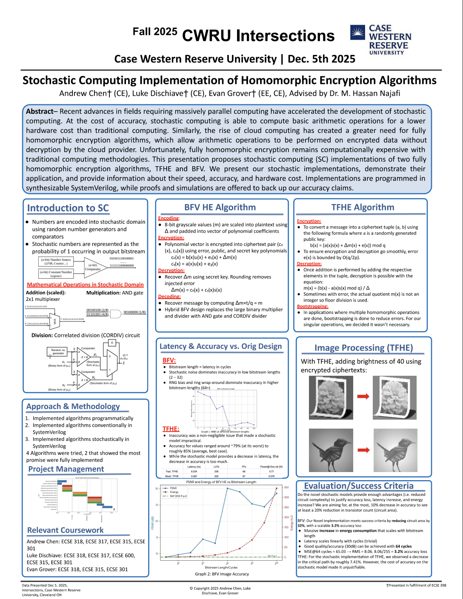
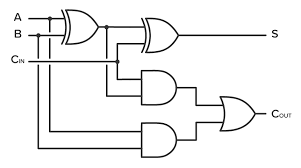

# mini-TFHE

This was my senior engineering design project for the **Fall 2025** semester at Case Western Reserve University.
We explore homomorphic encryption algorithms, how to implement them in hardware, and how we can address computational
bottlenecks of such homomorphic encryption algorithms.
<p align="center">
  
</p>

## Preface 

By definition, homomorphic encryption algorithms are a class of algorithms which preserve privacy when doing computations over encrypted data sets, also known as ciphertexts. What makes it homomorphic is that doing basic operations like addition with these ciphertexts is the same as doing addition with the numbers that these ciphertexts represent, "preserving" the intended value. 

---

## TFHE Encrytion Process

Before we encrypt a message, we need to define a couple of parameters:
* p (plaintext modulus): must be a value of base 2.
* q (ciphertext modulus): like `p`, this must also be a value of base 2, and must be larger than `p`.
* a (public key): any random integer between `0-p`, usually generated by a LFSR circuit and is publicly visible.
* s (secret key): a secret key that must be shared between the encryptor and decryptor, and `s` must be bounded by O(log q), where the base of the logarithm is 2.
* e (some random error): noise that makes the ciphertext more resistant to brute force guessing.

Let's say we're given some message to encrypt, `m=3`:


---

## Bottlenecks/Constraints 

Consider the full adder circuit:
<p align="center">
  
</p>

This circuit serves as the building block for all homomorphic encryption algorithms, as it is used for both addition and multiplication modules. The issue is the high transistor count associated with the use of `XOR` gates, as well as the propagation delay that comes with the ripple carry effect of such adders. There are more efficient architectures that aim to combat the propagation delay of such adders, such as carry lookahead adders. However, the issue of high transistor count remains, with each XOR gate taking **12 transistors** (in static CMOS).

---

## Stochastic Computing

---

## Experiment Process

For my specific algorithm (TFHE), I would like to test some image processing techniques by adjusting brightness on the given flower image.

<p align="center">
  
</p>

We need to first convert this image to a grayscale image, where each pixel is clamped between `0-255`, making it possible to represent a 64x64 image as a 2-dimensional array of bytes.

```Python
import os
import numpy as np
from PIL import Image

script_dir = os.path.dirname(os.path.abspath(__file__))
image_path = os.path.join(script_dir, "flower_icon.png")

image = Image.open(image_path)
image = image.resize((64, 64))  
image = image.convert('L')  # convert to grayscale

grayscale_array = np.array(image).flatten()

print(f"Total pixels: {len(grayscale_array)}")  # Should be 4096
print(f"Value range: {grayscale_array.min()} to {grayscale_array.max()}")

image.save('flower_icon_grayscale.png')

# write to Verilog .mem file (hex format) 
with open("image_data.mem", "w") as f:
    for i, pixel in enumerate(grayscale_array):
        f.write(f"{pixel:02X}")
        if (i + 1) % 64 == 0:  # new line every 64 values (one row)
            f.write("\n")
        else:
            f.write(" ")
```

This creates the following grayscale image, which then can be represented using a `.mem` file type. This will be useful for our Verilog implementation later.

<p align="center">
  
</p>

---

## Verilog Implementation

Given how I've explained the encryption and decryption modules,
we can design those using Verilog:

```Verilog
`timescale 1ns / 1ps

module hep (
    input [7:0] pixel_byte,   // input byte
    input [9:0] public_key,   // public key = a
    input [10:0] ct_modulus,   // ciphertext modulus = q
    input [8:0] pt_modulus,   // plaintext modulus = p
    input error,
    output [19:0] ciphertext
    );
    // p and q have to be consistent for all HEP/HDP slices
    // generating a public key can be any value from 0 to q-1
    
    // s needs to be consistent but is abstracted away for demonstration purposes
    // in theory all modules generate a secret key but assume they all agree on 7
    parameter secret_key = 7;
    wire [2:0] delta = 4;
    
    reg [9:0] b;

    // calculate b using your public key
    always @(*) begin
        b = (public_key * secret_key) + (delta * pixel_byte) + error;
    end
    
    // do final assignments
    assign ciphertext[19:10] = public_key;
    assign ciphertext[9:0] = b;
    
endmodule
```

```Verilog
`timescale 1ns / 1ps

module hdp (
    input [19:0] ciphertext,
    input [10:0] ct_modulus,   // ciphertext modulus = q
    input [8:0] pt_modulus,   // plaintext modulus = p
    output [7:0] res
    );
    
    reg[19:0] res_i;
    
    // p and q have to be consistent for all HEP/HDP slices
    // generating a public key can be any value from 0 to q-1
    
    // s needs to be consistent but is abstracted away for demonstration purposes
    // in theory all modules generate a secret key but assume they all agree on 7
    parameter secret_key = 7;
    reg[1:0] delta_shift = 2; // divide by four means shifting 2 places
    
    // determine the final result
    always @(*) begin
        // first compute b - as mod q
        // b = ciphertext[9:0]
        // a = ciphertext[19:10]
        // s = secret key
        res_i = (ciphertext[9:0] - (ciphertext[19:10] * secret_key)) % ct_modulus;
        res_i = res_i >> delta_shift; // final division to decrypt
    end
    
    assign res = res_i[7:0];
endmodule
```

---

## Results

---

